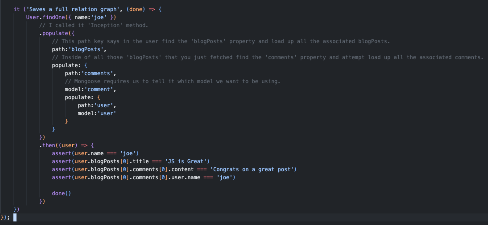
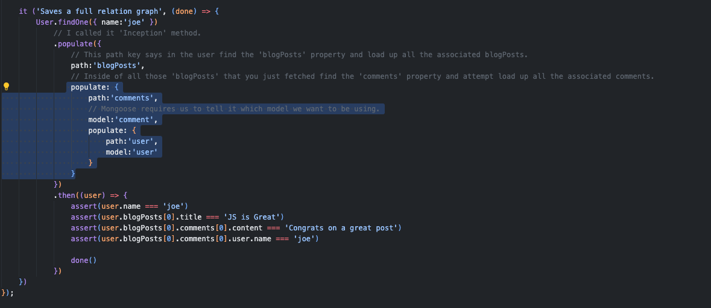

# MongoDB testing database

## [./users/test/association_test.js](https://github.com/Ash310u/MongodbWorkspace/blob/main/prod/users/test/association_test.js)

## Inside this test I used, what I called it 'Inception' method =>

<pre>

</pre>

## There is just one little issue when we start loading up these nested associations, Mongoose requires us to tell it which model we want to be using =>

<pre>

</pre>
