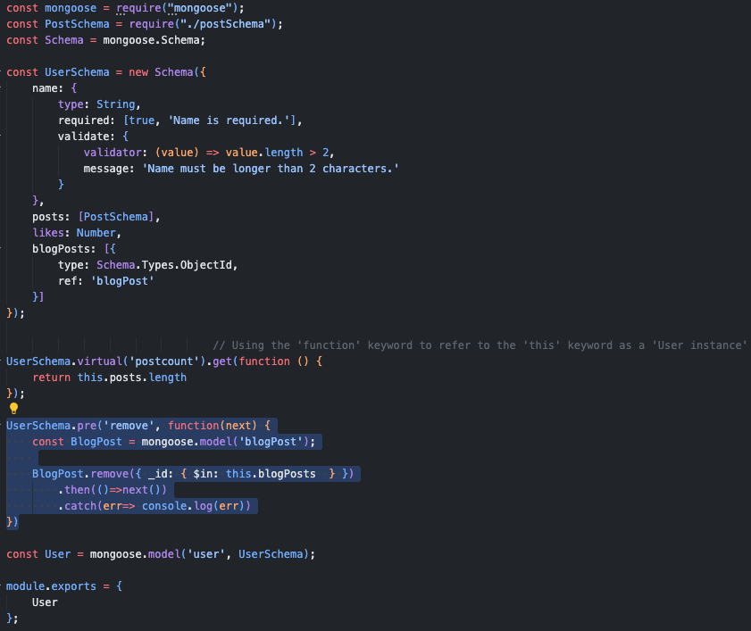
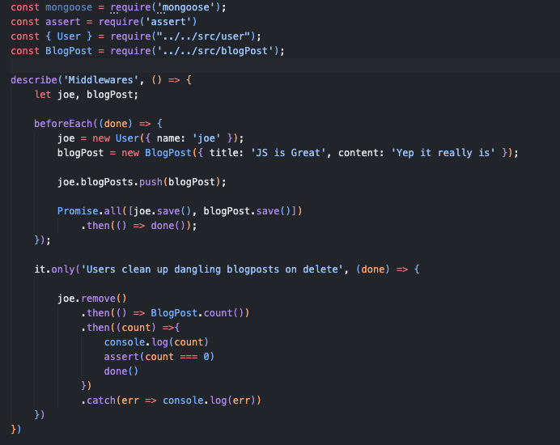
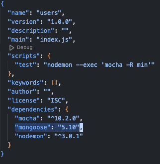

# Mongoose deprecated remove method with pre middleware

### Here I try to use "Schema.pre('remove')" middleware and "remove function" but its not working in the latest version of mongoose npm module(7.0) and I then found that this 'remove' method was deprecated since 2018.

<pre>
    <h3>User Model with pre remove middleware</h3>
    

    <h3>Middleware test case by mocha</h3>
    

    <h3>Mongoose version</h3>
    
</pre>
